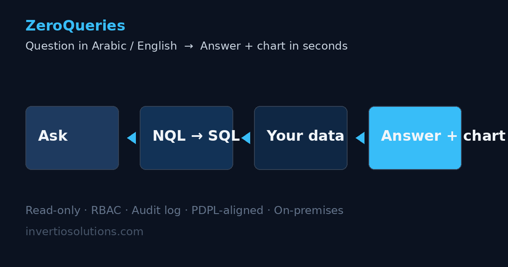

# ZeroQueries

### Ask your database in plain Arabic or English. Get answers and charts in seconds.

ZeroQueries is an enterprise natural-language-to-SQL layer that lets non-technical teams ask business questions in **Arabic or English** — and get instant, accurate answers with visual charts, directly from production data. **Read-only by design.** **RBAC-governed.** **PDPL-aligned.** Built for organizations that cannot afford to move data, or risk it, to answer simple questions.



---

## Why it exists

Every data-rich organization has the same bottleneck: the questions are in the boardroom, but the answers are locked in databases — behind SQL skills, tickets, and week-long BI cycles.

| Without ZeroQueries | With ZeroQueries |
|---|---|
| Analyst ticket → 3–5 day turnaround | Instant answer, 24/7 |
| Questions only IT can translate to SQL | Plain Arabic / English questions |
| Static dashboards built for yesterday's questions | Dynamic answers to today's questions |
| Shadow spreadsheets and data sprawl | Governed, auditable, read-only access |

---

## How it works

```
┌─────────────┐     ┌──────────────┐     ┌──────────────┐     ┌─────────────┐
│  Arabic or  │ ──▶ │  ZeroQueries │ ──▶ │  Your data   │ ──▶ │  Answer +   │
│  English    │     │   (NQL→SQL)  │     │  (read-only) │     │  chart      │
│  question   │     │  RBAC+audit  │     │   on-prem    │     │  in seconds │
└─────────────┘     └──────────────┘     └──────────────┘     └─────────────┘
```

1. **Ask** — a user types a question in natural language: Arabic or English.
2. **Translate** — ZeroQueries converts the question into a **validated SQL query** against your schema.
3. **Execute** — the query runs against your database with **read-only credentials**, scoped by role.
4. **Answer** — results return as an answer, a table, or a chart — in seconds.

No data leaves your environment. No schema is exposed to the user. No write operations are possible.

---

## Capabilities

- **Natural language in Arabic and English** — including Arabic dialect and mixed usage
- **Natural-language-to-SQL** with schema-aware validation
- **Instant charts** — answers visualized automatically (bar, line, pie, table)
- **Read-only enforcement** — SELECT-only at the database and proxy level
- **Role-based access control (RBAC)** — users only see the data their role allows
- **Full audit log** — every question and every generated query is recorded
- **PDPL alignment** — built with Saudi Personal Data Protection Law compliance in mind
- **On-premises / enterprise deployment** — your servers, your data, your control
- **Connects to existing databases** — no migration, no data movement

---

## Example — Arabic question to chart

> **سؤال:** ما هي مبيعاتنا في الرياض الشهر الماضي؟
> *(What were our sales in Riyadh last month?)*

```sql
SELECT DATE_TRUNC('month', order_date)   AS month,
       SUM(total_amount)                 AS sales
FROM   orders o
JOIN   branches b ON b.id = o.branch_id
WHERE  b.city = 'Riyadh'
  AND  order_date >= DATE_TRUNC('month', CURRENT_DATE - INTERVAL '1 month')
GROUP  BY DATE_TRUNC('month', order_date);
```

**Result:** an instant answer with a sales chart, accessible to the retail manager who asked — without a ticket, without IT, without touching the database directly.

See [examples/](examples/) for more questions in both languages.

---

## Architecture & deployment

- **Deployment:** on-premises, private cloud, or dedicated VPC — data never leaves your boundary
- **Access model:** read-only database credentials + application-level RBAC
- **Auditing:** every natural-language question, generated SQL, and result is logged
- **Compliance:** architecture designed for PDPL and similar data-protection regimes

See [docs/architecture.md](docs/architecture.md) for the full technical breakdown.

---

## Is ZeroQueries for you?

- **Basic to mid-market:** teams with data trapped in spreadsheets and unanswered questions
- **Enterprise / advanced:** organizations needing governed, auditable, PDPL-aligned data access at scale
- **Data-rich sectors:** retail, healthcare, logistics, manufacturing, finance, government

If a 30-minute demonstration — built around your own questions and your own systems — would be useful, contact us.

---

## Contact

**Aamir Zameer** — Managing Partner, KSA Region
📞 +966 58 210 4381
📧 azengineeringapp@gmail.com

*We are happy to arrange a live demo or an in-person meeting at LEAP 2026 (Riyadh, Aug 31 – Sep 3).*

---

© 2026 Invertio Solutions — [invertiosolutions.com](https://invertiosolutions.com). ZeroQueries is a product of Invertio.
